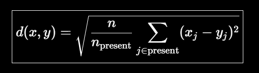
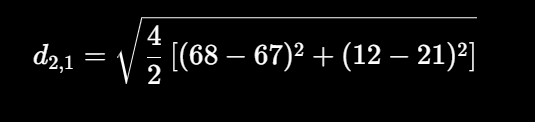
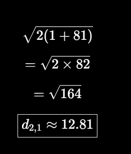
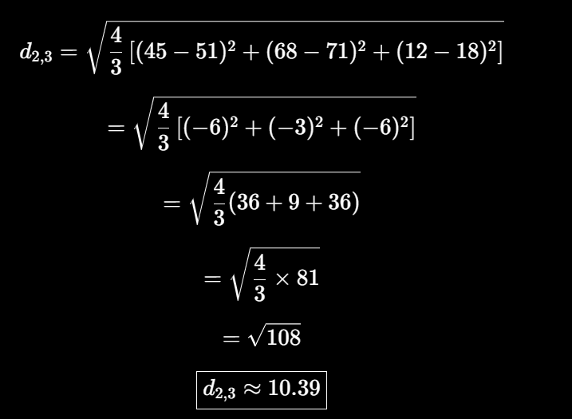
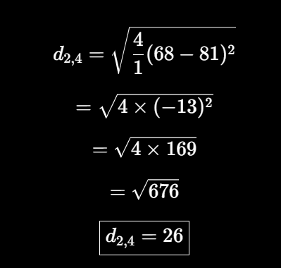
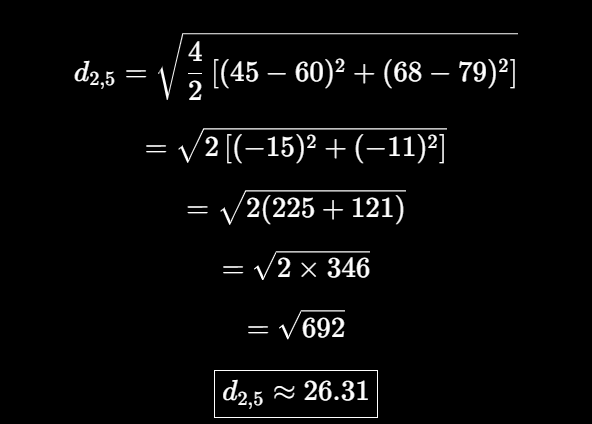
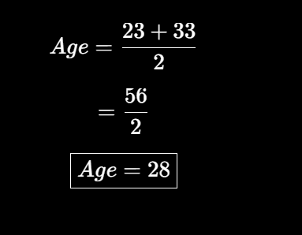

## Google colab code file :
https://colab.research.google.com/drive/1ymFFUgcgadoAl4drWrQd7vcvQMZ5DNym?usp=sharing  


# Multivariate Imputation using KNN Imputer

## 1. What is Multivariate Imputation?

**Multivariate Imputation** is a technique used to fill missing (`NaN`) values by considering the relationship between multiple columns.

One popular method is **KNN Imputer (K-Nearest Neighbors Imputer)**.

Instead of filling a missing value using only the column's mean or median, KNN Imputer finds the **most similar rows** and uses their values to estimate the missing value.

---

## 2. KNN Imputer

KNN stands for **K-Nearest Neighbors**.

### Basic Working

1. Find the row containing the missing value.
2. Calculate its distance from other rows.
3. Ignore columns where either row has a missing value.
4. Find the nearest `K` rows.
5. Use the values from those nearest rows to fill the missing value.

---

## 3. NaN Euclidean Distance

When some values are missing, we cannot use the normal Euclidean distance directly.

The **NaN Euclidean distance** considers only the features that are available in both rows.

For `n` total features:



Where:

* `n` = total number of features
* `n_present` = number of features available in both rows
* Only non-missing values are used.

---

## 4. Example Dataset

| ID | Age | Experience | Salary | Score |
| -: | --: | ---------: | -----: | ----: |
|  1 |  33 |         -- |     67 |    21 |
|  2 |  -- |         45 |     68 |    12 |
|  3 |  23 |         51 |     71 |    18 |
|  4 |  40 |         -- |     81 |    -- |
|  5 |  35 |         60 |     79 |    -- |

We want to calculate the missing **Age of Row 2**.

Row 2 is:

`[ --, 45, 68, 12 ]`

Since Age is missing, we compare Row 2 with other rows using the remaining available columns.

---

## 5. Distance: Row 2 vs Row 1

Common values:

* Salary: `68` and `67`
* Score: `12` and `21`

There are 4 total features and 2 common features.





Row 1 has Age = **33**.

---

## 6. Distance: Row 2 vs Row 3

Common values:

* Experience: `45` and `51`
* Salary: `68` and `71`
* Score: `12` and `18`

There are 4 total features and 3 common features.



Row 3 has Age = **23**.

---

## 7. Distance: Row 2 vs Row 4

Only Salary is common.



Row 4 has Age = **40**.

---

## 8. Distance: Row 2 vs Row 5

Common values:

* Experience: `45` and `60`
* Salary: `68` and `79`



Row 5 has Age = **35**.

---

## 9. Compare Distances

| Compared Row | NaN Euclidean Distance | Age |
| -----------: | ---------------------: | --: |
|        Row 3 |              **10.39** |  23 |
|        Row 1 |              **12.81** |  33 |
|        Row 4 |                  26.00 |  40 |
|        Row 5 |                  26.31 |  35 |

The two nearest neighbors are:

1. **Row 3 → Age = 23**
2. **Row 1 → Age = 33**

---

## 10. Calculate Missing Age

If we use:

[
K=2
]

then take the average of the two nearest neighbors:



Therefore, the missing Age in **Row 2 is estimated as 28**.

---

## 11. Final Dataset

| ID |    Age | Experience | Salary | Score |
| -: | -----: | ---------: | -----: | ----: |
|  1 |     33 |         -- |     67 |    21 |
|  2 | **28** |         45 |     68 |    12 |
|  3 |     23 |         51 |     71 |    18 |
|  4 |     40 |         -- |     81 |    -- |
|  5 |     35 |         60 |     79 |    -- |

---

## 12. Python Implementation

```python
import pandas as pd
from sklearn.impute import KNNImputer

data = {
    "Age": [33, None, 23, 40, 35],
    "Experience": [None, 45, 51, None, 60],
    "Salary": [67, 68, 71, 81, 79],
    "Score": [21, 12, 18, None, None]
}

df = pd.DataFrame(data)

imputer = KNNImputer(n_neighbors=2)

df_imputed = pd.DataFrame(
    imputer.fit_transform(df),
    columns=df.columns
)

print(df_imputed)
```

### Important Note

The manual calculation above demonstrates **how KNN distance works** and gives an intuitive result of **28** for Row 2's Age using `K=2`.

The exact result from `sklearn`'s `KNNImputer` can differ in a complete dataset because the implementation calculates distances and neighbor-based imputations according to its own algorithm and handles missingness across all features.

---

## 13. Summary

**KNN Imputer workflow:**

```text
Dataset
   ↓
Find Missing Value
   ↓
Calculate NaN Euclidean Distance
   ↓
Find Nearest K Rows
   ↓
Take Their Values
   ↓
Calculate Average / Weighted Average
   ↓
Fill Missing Value
```

### Key Point

> **KNN Imputer fills a missing value using information from the most similar rows instead of simply using mean or median.**
