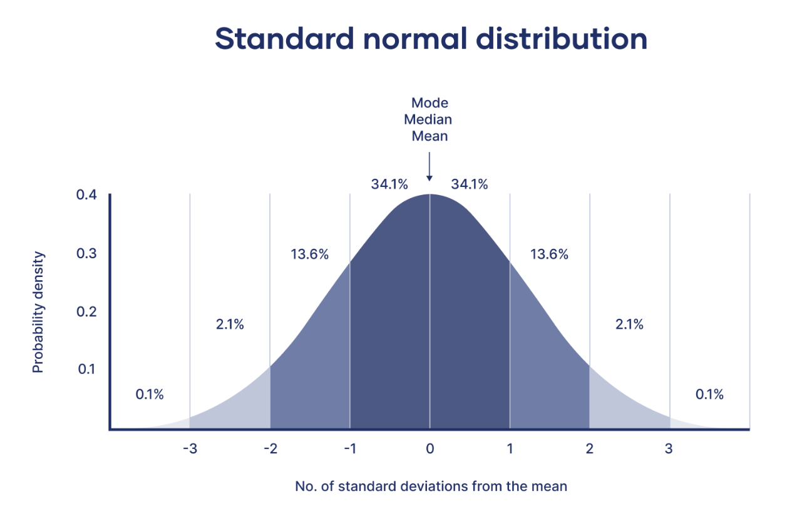

# Outlier Removal Using Z-Score

## Overview

Outliers are observations that are significantly different from the majority of the data. They can negatively affect statistical analysis and machine learning models.

One common technique for detecting outliers is the **Z-score method**.

### Z-Score

The Z-score measures how many standard deviations a data point is away from the mean.

A commonly used rule is:

* **Z-score between -3 and +3** → considered a normal observation
* **Z-score less than -3 or greater than +3** → considered an outlier

---

## Outlier Treatment

Once outliers are identified, there are several ways to handle them.

### 1. Trimming

**Trimming** means completely removing observations that are identified as outliers.

**Steps:**

1. Calculate the Z-score for each observation.
2. Identify observations where `|Z-score| > 3`.
3. Remove those observations from the dataset.

**Example:**

If a dataset contains 1,000 observations and 20 observations have a Z-score greater than ±3, those 20 observations can be removed.

**Advantages:**

* Simple to implement.
* Removes extreme values that may distort analysis.

**Disadvantages:**

* Results in loss of data.
* Genuine extreme observations may be removed.

---

### 2. Capping

**Capping** means keeping the outliers but replacing their extreme values with a predefined upper or lower limit.

For example, values above the upper threshold can be replaced with the upper threshold, while values below the lower threshold can be replaced with the lower threshold.

**Example:**

If the acceptable range is:

* Lower limit = 10
* Upper limit = 100

Then:

* 5 → becomes 10
* 50 → remains 50
* 150 → becomes 100

**Advantages:**

* Does not remove observations.
* Preserves the size of the dataset.
* Reduces the influence of extreme values.

**Disadvantages:**

* Changes the original values.
* May hide meaningful extreme observations.

---

## Trimming vs Capping

| Method       | What it does                        | Data loss | Values changed |
| ------------ | ----------------------------------- | --------: | -------------: |
| **Trimming** | Removes outliers                    |       Yes |             No |
| **Capping**  | Replaces extreme values with limits |        No |            Yes |

## Conclusion

Z-score is a useful method for identifying extreme observations in approximately normally distributed data.

After detecting outliers, **trimming** can be used when extreme observations should be removed, while **capping** is useful when we want to retain all observations but reduce the influence of extreme values.

> **Note:** A Z-score threshold such as ±3 is a rule of thumb, not a universal requirement. The appropriate treatment should depend on the distribution of the data and the business or analytical context.
