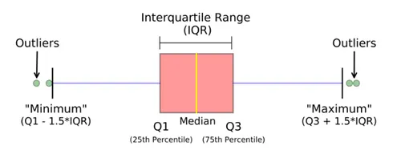

# Outlier Detection Using IQR

## Overview

The **Interquartile Range (IQR)** method is a statistical technique used to detect outliers in a dataset.

The IQR represents the spread of the middle **50%** of the data.

### Key Concepts

* **Q1 (First Quartile):** 25th percentile
* **Q2 (Median):** 50th percentile
* **Q3 (Third Quartile):** 75th percentile
* **IQR:** Difference between Q3 and Q1

### Formula

**IQR = Q3 − Q1**

The lower and upper boundaries for detecting outliers are:

**Lower Bound = Q1 − 1.5 × IQR**

**Upper Bound = Q3 + 1.5 × IQR**

Any observation:

* Less than the **Lower Bound** → Outlier
* Greater than the **Upper Bound** → Outlier
* Between the two bounds → Normal observation

---

## Example

Suppose:

* Q1 = 20
* Q3 = 50

Then:

**IQR = 50 − 20 = 30**

Lower Bound:

**20 − (1.5 × 30) = -25**

Upper Bound:

**50 + (1.5 × 30) = 95**

Therefore, values below **-25** or above **95** are considered outliers.

---

## Outlier Treatment

After identifying outliers using IQR, two common approaches are:

### 1. Trimming

Remove observations that fall outside the lower and upper bounds.

### 2. Capping

Replace observations outside the bounds with the corresponding boundary value.

For example:

* Values below the lower bound → replace with the lower bound
* Values above the upper bound → replace with the upper bound

---

## Advantages of IQR Method

* Simple and easy to understand.
* Does not require the data to follow a normal distribution.
* Less affected by extreme values than mean and standard deviation.
* Commonly used for numerical data.

## Conclusion

The **IQR method** is a robust technique for detecting outliers. It identifies observations that fall significantly below **Q1** or above **Q3** using the **1.5 × IQR rule**. After detection, outliers can either be **trimmed** or **capped**, depending on the requirements of the analysis.

