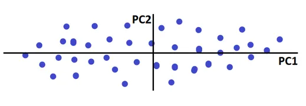

# PCA (Principal Component Analysis)

**PCA (Principal Component Analysis)** is an **unsupervised machine learning technique** used for **dimensionality reduction**.

It transforms the original features into a new set of features called **Principal Components (PCs)** while trying to preserve as much information as possible.



---

# Example of Dimensionality Reduction

Imagine taking a photograph of an object.

The real-world object exists in **3D**, but a photograph represents it in **2D**.

```text
Original Object
      ↓
     3D
      ↓
   Photograph
      ↓
     2D
```

Similarly, PCA can reduce a dataset from a higher-dimensional space to a lower-dimensional space.

For example:

```text
3D → 2D
```

---

# Benefits of PCA

### 1. Faster Execution

When the number of features is reduced, machine learning algorithms have fewer calculations to perform.

```text
More Features
      ↓
More Computation
      ↓
Slower Execution
```

PCA can reduce the number of features and therefore potentially make model training and prediction faster.

### 2. Visualization

It is difficult to visualize data having many dimensions.

PCA can reduce data to:

* **2 dimensions** → 2D visualization
* **3 dimensions** → 3D visualization

---

# Geometric Intuition of PCA

Suppose the data is distributed like this:

```text
                 Y
                 ↑
                 |
             •   |
          •      |
       •         |
    •            |
  •              |
  ----------------------------→ X
```

Here, there is more variation along the **X-axis** and less variation along the **Y-axis**.

The direction with greater variation contains more information about the data's structure.

PCA therefore tries to find a direction in which the data has **maximum variance**.

> **PCA finds the direction in which the variance of the projected data is maximum.**

---

# Feature Selection vs PCA

Suppose we have the following dataset:

| No. of Rooms | Grocery Shop | Price |
| -----------: | ------------ | ----: |
|            2 | Yes          |   50L |
|            3 | No           |   70L |
|            4 | Yes          |   90L |

If the **Grocery Shop** feature is not useful, we can simply remove it.

```text
No. of Rooms | Grocery Shop | Price
       ↓
No. of Rooms | Price
```

This is called **Feature Selection**.

---

## When Feature Selection Does Not Work Well

Consider:

| No. of Rooms | No. of Washrooms | Price |
| -----------: | ---------------: | ----: |
|            2 |                2 |   50L |
|            3 |                2 |   70L |
|            4 |                3 |   90L |

Both **No. of Rooms** and **No. of Washrooms** may contain useful information.

If we remove one of them, we may lose important information.

Here, PCA can be useful.

PCA combines information from the original features and creates new features called **Principal Components**.

For example:

```text
No. of Rooms ───────┐
                    ├──→ Principal Component 1
No. of Washrooms ───┘
```

The transformed dataset may look conceptually like:

| Size of Flat | Price |
| -----------: | ----: |
|          2.1 |   50L |
|          3.2 |   70L |
|          4.5 |   90L |

Here, **Size of Flat** is a new feature created from the original features.

This is called **Feature Extraction**.

---

# Number of Principal Components

If the original dataset contains `n` features:

```text
Number of Principal Components ≤ n
```

For example, if there are 3 original features:

```text
Feature 1
Feature 2
Feature 3
    ↓
   PCA
    ↓
PC1, PC2, PC3
```

We can choose fewer components:

```text
3D → 2D
```

or

```text
3D → 1D
```

---

# Why Is Variance Important?

## What is Variance?

Variance measures how much the values in a dataset are spread around their mean.

For example:

```text
Dataset A:

10  10  10  10  10
```

The values are very close to each other.

Therefore:

**Low variance**

Another dataset:

```text
Dataset B:

2   5   10   20   30
```

The values are more spread out.

Therefore:

**High variance**

---

## What is Spread?

**Spread** describes how far apart the data points are.

```text
Low Spread:

      • • • • •


High Spread:

•       •          •        •
```

Variance gives us a mathematical measure of this spread.

---

# Why Does PCA Use Variance?

PCA assumes that directions with greater variance contain more useful information about the structure of the data.

Therefore, PCA searches for a direction where the projected data has **maximum variance**.

---

# Problem Formulation

The main objective of PCA can be expressed as:

> **Find a unit vector that maximizes the variance of the projected data.**

Suppose `w` is a unit vector.

The projection of a data point `x` onto `w` is:

```text
z = wᵀx
```

PCA tries to find `w` such that the variance of `z` is maximum.

The constraint is:

```text
||w|| = 1
```

Therefore:

```text
Maximize:

Var(wᵀX)

Subject to:

||w|| = 1
```

The direction that maximizes this variance becomes the **first principal component (PC1)**.

---

# Covariance

Covariance tells us how two variables change with respect to each other.

For two variables `A` and `B`:

```text
Cov(A, B)
```

Important relationships:

```text
Cov(A, A) = Var(A)

Cov(A, B) = Cov(B, A)
```

### Positive Covariance

If two variables tend to increase together:

```text
A ↑  →  B ↑
```

then covariance is generally **positive**.

### Negative Covariance

If one variable tends to increase while the other decreases:

```text
A ↑  →  B ↓
```

then covariance is generally **negative**.

### Near-Zero Covariance

If there is little or no linear relationship between two variables, their covariance can be close to zero.

> **Important:** Covariance describes the direction of a linear relationship, not necessarily causation.

---

# Covariance Matrix

A covariance matrix stores the covariance between pairs of features.

For two features `A` and `B`:

```text
              A          B

A          Cov(A,A)   Cov(A,B)

B          Cov(B,A)   Cov(B,B)
```

Since:

```text
Cov(A,A) = Var(A)
Cov(B,B) = Var(B)
Cov(A,B) = Cov(B,A)
```

the covariance matrix becomes:

```text
[ Var(A)      Cov(A,B) ]
[ Cov(B,A)    Var(B)   ]
```

---

# 3 × 3 Covariance Matrix

For three features `A`, `B`, and `C`:

```text
[ Var(A)     Cov(A,B)   Cov(A,C) ]

[ Cov(B,A)  Var(B)      Cov(B,C) ]

[ Cov(C,A)  Cov(C,B)   Var(C)    ]
```

The diagonal contains the **variance** of each feature.

The off-diagonal elements contain the **covariance** between pairs of features.

---

# Information in a Covariance Matrix

A covariance matrix provides important information about the data.

### 1. Variance Terms

The diagonal elements show the variance of each feature.

They tell us how much the data is spread along the corresponding feature axes.

### 2. Covariance Terms

The off-diagonal elements show how pairs of features vary together.

They help describe the **orientation and relationship** between the variables.

### 3. Overall Structure

The covariance matrix summarizes the variance and pairwise covariance structure of the dataset.

---

# Matrix and Linear Transformation

PCA can be understood using **linear algebra**.

A matrix can represent a linear transformation that changes the representation or coordinate system of data.

PCA finds a new coordinate system where:

* The first axis represents the direction of maximum variance.
* The second axis represents the next highest variance direction.
* Subsequent axes represent progressively smaller amounts of variance.

These new axes are the **principal components**.

---

# Eigen Decomposition of the Covariance Matrix

Eigenvalues and eigenvectors are fundamental to PCA.

We calculate the eigenvalues and eigenvectors of the covariance matrix.

```text
Covariance Matrix
       ↓
Eigen Decomposition
       ↓
Eigenvalues + Eigenvectors
```

### Eigenvectors

The eigenvectors represent the **directions** of the principal components.

### Eigenvalues

The eigenvalues indicate **how much variance** is associated with their corresponding eigenvectors.

Therefore:

> **The eigenvector corresponding to the largest eigenvalue points in the direction of maximum variance.**

That eigenvector represents **PC1**.

---

# Step-by-Step PCA

Suppose we have a dataset with **3 input features**.

## Step 1: Mean Centering

First, calculate the mean of each feature and subtract it from every observation.

```text
X_centered = X - mean(X)
```

This moves the center of the data to approximately zero.

> If features have very different scales, PCA is commonly performed after **standardization** so that large-scale features do not dominate the analysis.

---

## Step 2: Find the Covariance Matrix

Using the centered data, calculate the covariance matrix.

```text
Centered Data
      ↓
Covariance Matrix
```

For 3 features:

```text
[ Var(X₁)    Cov(X₁,X₂)   Cov(X₁,X₃) ]

[ Cov(X₂,X₁) Var(X₂)      Cov(X₂,X₃) ]

[ Cov(X₃,X₁) Cov(X₃,X₂)   Var(X₃)    ]
```

---

## Step 3: Find Eigenvalues and Eigenvectors

Calculate the eigenvalues and eigenvectors of the covariance matrix.

For 3 original features, we obtain:

```text
Eigenvalues:

λ₁
λ₂
λ₃
```

and corresponding eigenvectors:

```text
v₁
v₂
v₃
```

Sort the eigenvalues from largest to smallest:

```text
λ₁ > λ₂ > λ₃
```

The corresponding eigenvectors are ordered in the same way.

Therefore:

```text
v₁ → PC1
v₂ → PC2
v₃ → PC3
```

where **PC1** captures the largest amount of variance.

---

# How to Transform a Point

Suppose we want to reduce a **3D dataset to 2D**.

We select the first two principal component directions:

```text
PC1
PC2
```

The original point can then be projected onto these two directions.

Conceptually:

```text
Original 3D Data
       ↓
      PCA
       ↓
   Projection
       ↓
Reduced 2D Data
```

Mathematically, if `W` contains the selected principal component vectors:

```text
Z = XW
```

where:

* `X` = centered input data
* `W` = selected eigenvectors
* `Z` = transformed/reduced data

---

# 3D → 1D

If we select only **PC1**:

```text
3D
 ↓
PCA
 ↓
PC1
 ↓
1D
```

Only the direction containing the maximum variance is retained.

---

# 3D → 2D

If we select **PC1 and PC2**:

```text
3D
 ↓
PCA
 ↓
PC1 + PC2
 ↓
2D
```

This preserves the variance represented by the first two principal components.

---

# How to Find the Optimal Number of Principal Components?

Each eigenvalue tells us how much variance is associated with its corresponding principal component.

Suppose:

```text
λ₁ = 70
λ₂ = 20
λ₃ = 10
```

Total variance:

```text
70 + 20 + 10 = 100
```

Therefore:

```text
PC1 → 70% variance
PC2 → 20% variance
PC3 → 10% variance
```

If we select PC1 and PC2:

```text
70% + 20% = 90%
```

So, 2 principal components explain **90% of the total variance**.

---

# Explained Variance Ratio

The explained variance ratio of a principal component is:

```text
Explained Variance Ratio
=
Eigenvalue of PC
----------------------------
Sum of all Eigenvalues
```

For example:

```text
λ₁ = 70
λ₂ = 20
λ₃ = 10

Total = 100
```

Then:

```text
PC1 = 70 / 100 = 70%

PC2 = 20 / 100 = 20%

PC3 = 10 / 100 = 10%
```

We can calculate cumulative explained variance:

```text
PC1                 → 70%
PC1 + PC2           → 90%
PC1 + PC2 + PC3     → 100%
```

We usually select enough principal components to retain a desired amount of variance, such as **90%, 95%, or 99%**, depending on the application.

---

# When Does PCA Not Work Well?

PCA is powerful, but it is not suitable for every situation.

### 1. When Interpretability of Original Features Is Important

PCA creates new features by combining the original features.

For example:

```text
PC1 = combination of Feature 1 + Feature 2 + Feature 3 + ...
```

Therefore, the resulting components can be harder to interpret than the original features.

If you need to know exactly which original feature is responsible for a prediction, feature selection may be preferable.

---

### 2. When the Data Is Non-Linear

Standard PCA mainly captures **linear relationships and linear directions of variance**.

If the important structure in the data is highly nonlinear, PCA may not capture it effectively.

For nonlinear dimensionality reduction, techniques such as:

* Kernel PCA
* t-SNE
* UMAP

may be more appropriate depending on the objective.

---

### 3. When Important Information Has Low Variance

PCA prioritizes high variance.

However, high variance does not always mean high predictive importance.

Sometimes a feature or direction with low variance can be very important for predicting the target.

Therefore:

> **Maximum variance does not always mean maximum predictive power.**

---

### 4. When Features Have Very Different Scales

Suppose we have:

```text
Age        → 20–60
Salary     → 20,000–200,000
```

Salary has a much larger numerical scale.

Without appropriate preprocessing, it can dominate the covariance calculation.

In such cases, **standardization** before PCA is often appropriate.

---

### 5. When the Dataset Is Already Low-Dimensional

If the dataset has only a few features and dimensionality is not causing computational or visualization problems, applying PCA may add unnecessary complexity.

---

# PCA Workflow

```text
Original Dataset
       ↓
Data Preprocessing
       ↓
Mean Centering / Standardization
       ↓
Covariance Matrix
       ↓
Eigenvalues + Eigenvectors
       ↓
Sort Eigenvalues
       ↓
Select Principal Components
       ↓
Project Data
       ↓
Reduced Dataset
```

---

# PCA in One Diagram

```text
       Original Features
              │
              ▼
     Mean Center / Scale
              │
              ▼
      Covariance Matrix
              │
              ▼
   Eigenvalues + Eigenvectors
              │
              ▼
     Sort by Eigenvalues
              │
              ▼
      Select Top PCs
              │
              ▼
        Project Data
              │
              ▼
      Reduced Dimensions
```

---

# Key Points to Remember

* **PCA = Principal Component Analysis**
* PCA is an **unsupervised** dimensionality reduction technique.
* PCA performs **feature extraction**, not feature selection.
* It creates new features called **Principal Components**.
* **PC1** captures the maximum variance.
* **PC2** captures the maximum remaining variance subject to being orthogonal to PC1.
* Eigenvectors determine the **directions** of the principal components.
* Eigenvalues indicate the **amount of variance** captured by those components.
* The number of principal components cannot exceed the number of original features.
* Explained variance helps determine the optimal number of components.
* PCA is mainly based on **linear transformations** and variance.
* Standardization is often important when features have different scales.

---

# Quick Revision

```text
PCA
│
├── Unsupervised Learning
│
├── Dimensionality Reduction
│
├── Feature Extraction
│
├── Uses Variance
│
├── Uses Covariance Matrix
│
├── Eigenvectors → Directions
│
├── Eigenvalues → Variance
│
├── Largest Eigenvalue
│      ↓
│     PC1
│
├── Second Largest Eigenvalue
│      ↓
│     PC2
│
└── Select PCs based on Explained Variance
```

## Final Idea

> **PCA finds new orthogonal directions (principal components) that maximize the variance of the projected data. By keeping only the most important components, we can reduce dimensionality while retaining a large portion of the data's variation.**
