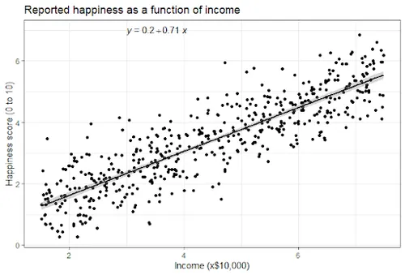
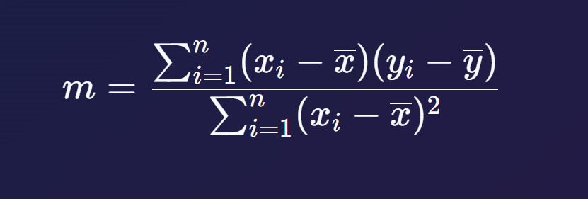
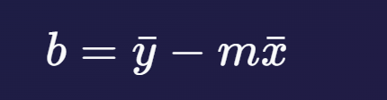
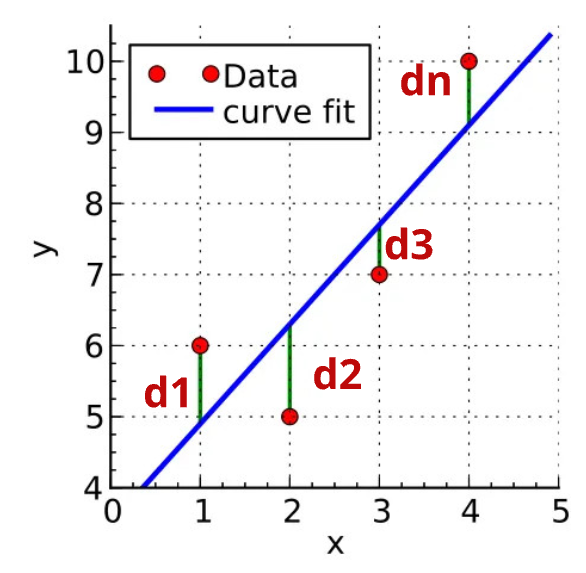
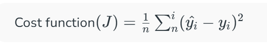
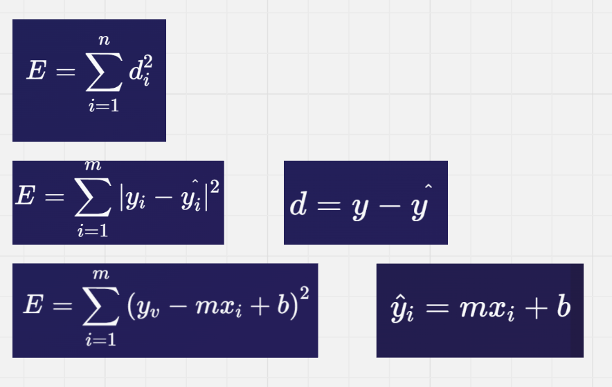
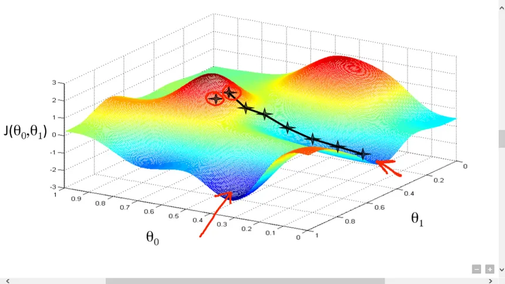

# Linear Regression

Linear Regression is a **Supervised Machine Learning Algorithm** that is used to predict a continuous numerical output based on one or more input features.

For example:

* CGPA → Input feature
* Package → Target/output

---

## Types of Linear Regression

There are mainly three types of Linear Regression:

1. **Simple Linear Regression**
2. **Multiple Linear Regression**
3. **Polynomial Linear Regression**

---

# Example

Suppose we have a dataset containing the CGPA of students and their corresponding package.

| CGPA | Package |
| ---- | ------- |
| 6.5  | 3.0 LPA |
| 7.0  | 3.5 LPA |
| 7.5  | 4.2 LPA |
| 8.0  | 5.0 LPA |
| 8.5  | 6.0 LPA |

Here:

* **CGPA** is the input/independent variable.
* **Package** is the output/dependent variable.

We can plot the data points and observe whether the relationship between CGPA and Package is approximately **linear or non-linear**.



---

# Equation of a Line

The equation of a straight line is:

$$
y = mx + b
$$

Where:

* `y` = predicted output
* `x` = input feature
* `m` = slope / weight
* `b` = intercept

---

# Mathematical Intuition

The main idea behind Linear Regression is to find the **best-fitting straight line** through the given data points.

The prediction is made using:

$$
\hat{y} = mx + b
$$

Where:

* `x` = input
* `ŷ` = predicted output
* `m` = weight/slope
* `b` = intercept

The algorithm tries to find the values of `m` and `b` such that the predicted values are as close as possible to the actual values.

---

# Role of `m` and `b`

## `m` — Slope / Weight

`m` tells us how much the value of `y` changes when the value of `x` changes by one unit.




For example:

$$
y = 2x + 3
$$

Here:

```text
m = 2
b = 3
```

If `x` increases by `1`, then `y` increases by `2`.

Therefore, `m` controls the **slope/steepness of the line**.

---

## `b` — Intercept




`b` represents the value of `y` when `x = 0`.

For example:

$$
y = 2x + 3
$$

When:

$$
x = 0
$$

Then:

$$
y = 3
$$

Therefore:

```text
b = 3
```

`b` controls where the line intersects the **Y-axis**.

---

# Mathematical Representation

The Linear Regression model can be represented as:

$$
\hat{y} = wx + b
$$

Here:

* `w` = weight
* `x` = input feature
* `b` = bias/intercept
* `ŷ` = predicted output

In simple Linear Regression:

$$
w = m
$$

So:

$$
\hat{y} = mx + b
$$

---

# How to Find `m` and `b`?

The main objective of Linear Regression is to find the best values of:

```text
m
b
```

so that the prediction error is minimized.

There are two common approaches:

1. **Closed Form Solution**
2. **Non-Closed Form Solution**

---

# Error Calculation

For every data point, there can be a difference between the:

* Actual value
* Predicted value

This difference is called **Error** or **Residual**.

The error for a data point can be written as:

$$
d_i = y_i - \hat{y}_i
$$

Where:

* `yᵢ` = actual value
* `ŷᵢ` = predicted value
* `dᵢ` = error/residual

---

## Sum of Errors

Suppose we have `n` data points.

The total error can be written as:

$$
E = d_1 + d_2 + d_3 + \ldots + d_n
$$

But there is a problem with this approach.

---

# Why Not Simply Add Errors?

The error can occur on **both sides of the regression line**.



For example:

```text
Error 1 = +5
Error 2 = -5
```

If we simply add them:

$$
5 + (-5) = 0
$$

The total error becomes zero.

But the predictions are clearly not perfect.

This is why we cannot simply minimize the sum of errors.




---

# Squared Error

To avoid positive and negative errors cancelling each other out, we square each error.

The total squared error becomes:

$$
E = d_1^2 + d_2^2 + d_3^2 + \ldots + d_n^2
$$

Or:

$$
E = \sum_{i=1}^{n}(y_i-\hat{y}_i)^2
$$

This is called the **Sum of Squared Errors (SSE)**.

The Linear Regression algorithm tries to find the line that minimizes this error.

---

# Why Not Use Absolute Error?

Another approach is to use the absolute value of errors:

$$
E = |d_1| + |d_2| + |d_3| + \ldots + |d_n|
$$

This is also a valid error measure.

However, traditional Linear Regression generally uses **squared error**.


---

## Why Squared Error?

Squared error has some important advantages:

### 1. Positive and Negative Errors

Squaring removes the negative sign.

For example:

$$
(-5)^2 = 25
$$

and:

$$
(5)^2 = 25
$$

So errors do not cancel each other.

### 2. Large Errors Get More Penalty

For example:

$$
2^2 = 4
$$

while:

$$
10^2 = 100
$$

Therefore, larger errors receive a much larger penalty.

### 3. Differentiable

The squared error function is smooth and differentiable.

This makes mathematical optimization easier.

---

# Cost Function

Instead of only considering the total error, Linear Regression commonly uses the **Mean Squared Error (MSE)**.

The formula is:

$$
MSE = \frac{1}{n}\sum_{i=1}^{n}(y_i-\hat{y}_i)^2
$$

Substituting:

$$
\hat{y}_i = mx_i+b
$$

we get:

$$
MSE = \frac{1}{n}\sum_{i=1}^{n}(y_i-(mx_i+b))^2
$$

The goal is:

$$
\min MSE
$$

In other words, we need to find the values of `m` and `b` that produce the minimum possible error.

---

# Closed Form Solution

Linear Regression can be solved mathematically using a **Closed Form Solution**.

For simple Linear Regression, the slope can be calculated using:

$$
m =
\frac{
\sum (x_i-\bar{x})(y_i-\bar{y})
}{
\sum (x_i-\bar{x})^2
}
$$

The intercept is:

$$
b = \bar{y} - m\bar{x}
$$

Where:

* `x̄` = mean of x values
* `ȳ` = mean of y values
* `m` = slope
* `b` = intercept




---

# Non-Closed Form Solution

When the dataset becomes more complex, or when we have many features, we can use an iterative optimization technique such as **Gradient Descent**.

The basic idea is:

1. Initialize the parameters.
2. Calculate predictions.
3. Calculate the error.
4. Calculate the gradient.
5. Update the parameters.
6. Repeat until the cost becomes sufficiently small.

The parameters are updated using:

$$
m = m - \alpha \frac{\partial J}{\partial m}
$$

and:

$$
b = b - \alpha \frac{\partial J}{\partial b}
$$

Where:

* `α` = learning rate
* `J` = cost function
* `m` = slope/weight
* `b` = intercept

---

# Special Cases

## If `b` is Constant

If `b` is fixed/constant, then we only need to optimize `m`.

In a simplified case:

$$
b = 0
$$

Therefore:

$$
y = mx
$$

Here, the regression line is forced to pass through the origin.

---

## If `m` is Constant

If `m` is fixed/constant, then we only need to optimize `b`.

For example:

$$
m = 1
$$

Then:

$$
y = x + b
$$

---

# Gradient Descent 

---

# Simple Linear Regression

Simple Linear Regression uses **one input feature** to predict one output.

The equation is:

$$
y = mx+b
$$

Example:

```text
CGPA → Package
```

Here:

```text
X = CGPA
Y = Package
```

---

# Multiple Linear Regression

Multiple Linear Regression uses **multiple input features** to predict one output.

The equation can be written as:

$$
y = b + w_1x_1 + w_2x_2 + \ldots + w_nx_n
$$

For example, package prediction could depend on:

```text
CGPA
IQ
Communication Skills
Technical Skills
Experience
```

Then:

$$
Package =
b + w_1(CGPA)

* w_2(IQ)
* w_3(Skills)
* \ldots
  $$

---

# Polynomial Linear Regression

Polynomial Regression is used when the relationship between the input and output is **non-linear**.

For example:

$$
y = b + w_1x + w_2x^2 + w_3x^3
$$

Although the curve can be non-linear with respect to `x`, the model is **linear in its parameters/coefficients**.

Example:

```text
y = b + w1x + w2x²
```

This can produce a curved regression line.

---

# Linear Regression Workflow

The basic workflow is:

```text
Dataset
   ↓
Select Features (X) and Target (Y)
   ↓
Plot the Data
   ↓
Check Relationship
   ↓
Create Linear Regression Model
   ↓
Find m and b
   ↓
Calculate Predictions
   ↓
Calculate Error / Cost
   ↓
Minimize Cost
   ↓
Best-Fit Line
   ↓
Prediction
```

---

# Important Formulas

### Line Equation

$$
y = mx+b
$$

### Prediction

$$
\hat{y} = mx+b
$$

### Error

$$
Error = y-\hat{y}
$$

### Squared Error

$$
Error^2 = (y-\hat{y})^2
$$

### Mean Squared Error

$$
MSE =
\frac{1}{n}
\sum_{i=1}^{n}
(y_i-\hat{y}_i)^2
$$

### Slope

$$
m =
\frac{
\sum (x_i-\bar{x})(y_i-\bar{y})
}{
\sum (x_i-\bar{x})^2
}
$$

### Intercept

$$
b = \bar{y}-m\bar{x}
$$

---

# Summary

Linear Regression is a **Supervised Machine Learning Algorithm** used to predict continuous numerical values.

The basic equation is:

$$
y = mx+b
$$

Where:

| Term | Meaning          |
| ---- | ---------------- |
| `x`  | Input feature    |
| `y`  | Actual output    |
| `ŷ`  | Predicted output |
| `m`  | Slope / Weight   |
| `b`  | Intercept / Bias |

The main objective is to find the best values of `m` and `b` that minimize the prediction error.

The commonly used cost function is:

$$
MSE =
\frac{1}{n}
\sum_{i=1}^{n}
(y_i-\hat{y}_i)^2
$$

The final goal of Linear Regression is to find the **best-fit line** that makes predictions as close as possible to the actual data points.
